<table>
  <tr>
    <td width="180" align="center">
      
    </td>
    <td>
      <h2>Jurusan Teknologi Informasi Politeknik Negeri Malang</h2>
      <h3>Ujian Tengah Semester Praktikum Aplikasi OCR</h3>
      <h3>Mata Kuliah Pemrograman Mobile</h3>
      <em>Oktober 2025</em>
    </td>
  </tr>
</table>

---

**Nama:** Khoir Karol Nurzuraidah  
**Kelas / NIM:** SIB 3C / 2341760048  
**No. Absen:** 20   
**Tanggal:** 22 OKtober 2025  
**Guru / Dosen:** Ade Ismail, S.Kom., M.TI.  

# 🚀 UTS Praktikum Aplikasi OCR 

## Instruksi Umum
1. Mahasiswa wajib menggunakan proyek Flutter ocr_sederhana yang telah dibuat
sebelumnya.  
2. Setiap penyelesaian tugas pada setiap Soal (Soal 1, Soal 2, dan Soal 3) harus diikuti dengan perintah Git commit dan push ke repositori GitHub masing-masing.  
3. Pesan Commit Wajib harus diikuti dengan tepat. Kelalaian dalam melakukan
commit dan push akan mengurangi poin penilaian

---

## Instruksi Awal (SETUP) - Wajib
1. Pastikan proyek ocr_sederhana sudah diinisialisasi sebagai repositori Git dan terhubung ke akun GitHub Anda. 
2. Lakukan commit awal untuk memastikan branch main Anda bersih. 
  • git add .  
  • git commit -m "UTS: Basis awal proyek OCR Sederhana"  
  • git push origin main 

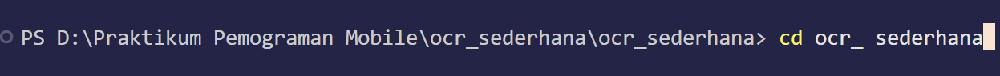
 

---

## Soal 1: Modifikasi Struktur Navigasi dan Aliran (30 Poin)
Tujuan: Menyederhanakan alur navigasi dan meningkatkan pengalaman pengguna di
HomeScreen. 
### **1. Pengubahan Navigasi Home (15 Poin):**
  • Ubah ElevatedButton di HomeScreen (lib/screens/home_screen.dart) menjadi *widget* **ListTile**. 
  • Atur ListTile: leading: Icon(Icons.camera_alt, color: Colors.blue);
  title: Text('Mulai Pindai Teks Baru').  
  • Fungsi onTap harus menggunakan Navigator.push() untuk ke ScanScreen. 

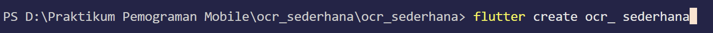
  

 ### **2. Teks Utuh dan Navigasi Balik (15 Poin):** 
  • Di ResultScreen (lib/screens/result_screen.dart), hapus fungsi ocrText.replaceAll agar hasil teks ditampilkan dengan baris baru (\n) yang utuh. 
  • Tambahkan FloatingActionButton dengan ikon Icons.home. 
  • Ketika tombol ditekan, navigasi harus kembali langsung ke HomeScreen menggunakan **Navigator.pushAndRemoveUntil()** (atau metode yang setara)
  untuk menghapus semua halaman di atasnya dari stack navigasi. 
  

 

### **Perintah Commit Wajib (Soal 1)**
Setelah Soal 1 selesai, lakukan commit dan push dengan pesan: 
  • git add lib/screens/home_screen.dart lib/screens/result_screen.dart 
  • git commit -m "UTS: Selesai Soal 1 - ListTile dan Navigasi Balik" 
  • git push origin main

  

 

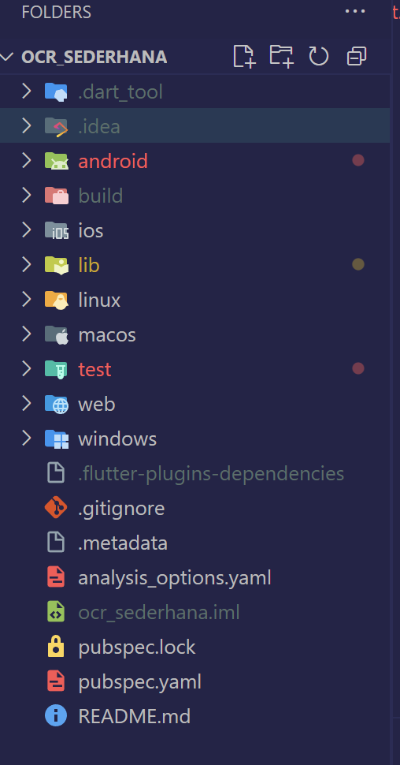
  

---

## Soal 2: Penyesuaian Tampilan dan Penanganan State/Error (40 Poin)
Tujuan: Memperbaiki tampilan **loading** dan memberikan **feedback** error yang lebih jelas. 
### **1. Custom Loading Screen di ScanScreen (20 Poin):**
  • Di ScanScreen (lib/screens/scan_screen.dart), modifikasi tampilan *loading* yang muncul sebelum kamera siap (if (!controller.value isInitialized)) : 
  • Latar Belakang: Scaffold(backgroundColor: Colors.grey[900]). 
  • Isi: Di dalam Center, tampilkan Column berisi CircularProgressIndicator(Colors.yellow). 
  • Di bawah indikator, tambahkan Text(’Memuat Kamera... Harap tunggu.’,
  style: TextStyle(color: Colors.white, fontSize: 18)). 

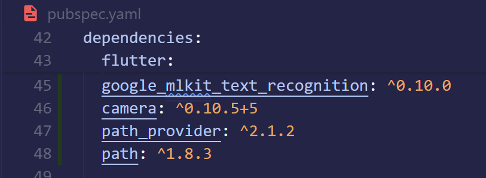

### **2. Spesifikasi Pesan Error (20 Poin):**
  • Di fungsi _takePicture() pada ScanScreen, modifikasi blok catch (e) untuk mengubah pesan *error* pada SnackBar. 
  • Pesan SnackBar harus berbunyi: "Pemindaian Gagal! Periksa Izin Kamera atau coba lagi." (Hilangkan variabel *error* ($e)). 

### **Perintah Commit Wajib (Soal 2)**
  Setelah Soal 2 selesai, lakukan commit dan push dengan pesan: 
  • git add lib/screens/scan_screen.dart 
  • git commit -m "UTS: Selesai Soal 2 - Tampilan Loading dan Error" 
  • git push origin main 

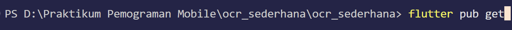
  

---

## Soal 3: Implementasi Plugin Text-to-Speech (TTS) (30Poin)
Tujuan: Mengintegrasikan fitur membaca teks secara lisan menggunakan **plugin** flutter_tts. 
### **1. Instalasi Plugin (5 Poin):**
  • Tambahkan *plugin* flutter_tts ke dalam file pubspec.yaml (gunakan versi
  terbaru yang kompatibel). 
  • Jalankan flutter pub get 

   

### **2. Konversi Widget dan Inisialisasi (10 Poin):**
  • Ubah ResultScreen dari StatelessWidget menjadi **StatefulWidget**.  
  • Di initState(), inisialisasi FlutterTts dan atur bahasa pembacaan menjadi Bahasa Indonesia. 
  • Implementasikan dispose() untuk menghentikan mesin TTS saat halaman
  ditutup. 

### **3. Fungsionalitas Pembacaan (15 Poin):**
  • Tambahkan FloatingActionButton kedua di ResultScreen (atau ganti AppBar
  dengan action button) dengan ikon Icons.volume_up. 
  • Ketika tombol ditekan, panggil fungsi speak() pada FlutterTts untuk membacakan seluruh isi ocrText. 

### **Perintah Commit Wajib (Soal 3)**
  Setelah Soal 3 selesai, lakukan commit dan push terakhir dengan pesan:
   • git add pubspec.yaml lib/screens/result_screen.dart
   • git commit -m "UTS: Selesai Soal 3 - Implementasi Flutter TTS"
   • git push origin main

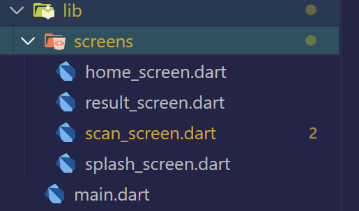

---

### **OUTPUT**

  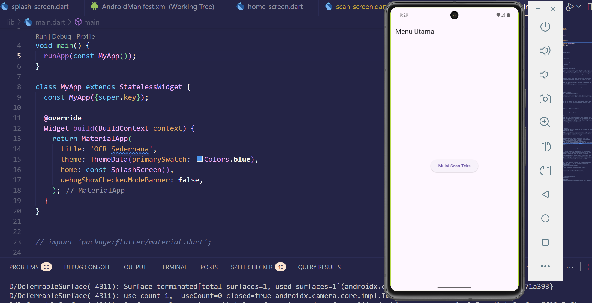 
  <b>'klik mulai scan teks'</b>

  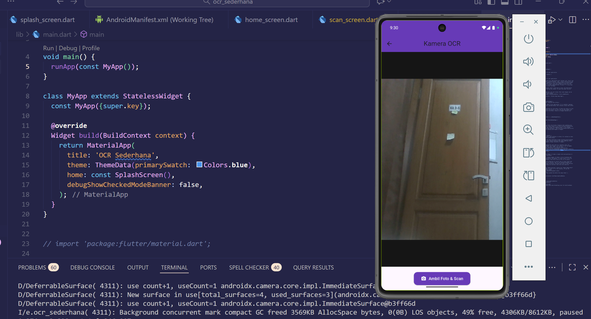 
  <b>'klik ambil foto dan scan'</b>

  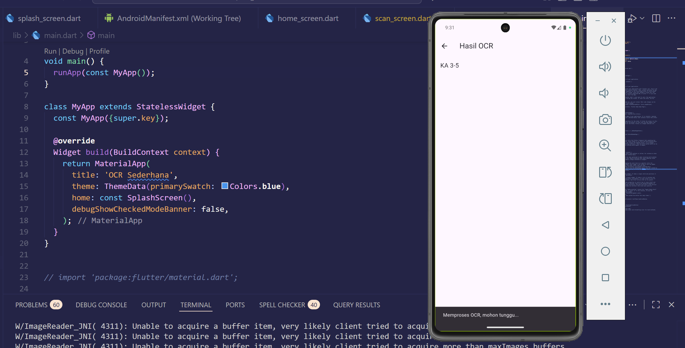 
  <b>'hasil dari scan foto di atas adalah KA 3-5'</b>

   
  <b>'hasil dari audio di atas adalah KA 3-5'</b>

---

<table>
  <tr>
    <td width="180" align="center">
      
    </td>
    <td>
      <h2>Jurusan Teknologi Informasi Politeknik Negeri Malang</h2>
      <h3>Jobsheet: Aplikasi OCR Sederhana Dengan Flutter</h3>
      <h3>Mata Kuliah Pemrograman Mobile</h3>
      <em>Oktober 2025</em>
    </td>
  </tr>
</table>

---

**Nama:** Khoir Karol Nurzuraidah  
**Kelas / NIM:** SIB 3C / 2341760048  
**No. Absen:** 20   
**Tanggal:** 16 OKtober 2025  
**Guru / Dosen:** Ade Ismail, S.Kom., M.TI.  

# 🚀 Praktikum Aplikasi OCR Sederhana Dengan Flutter

## 2. TUJUAN PRAKTIKUM
Setelah menyelesaikan jobsheet ini, siswa/mahasiswa mampu:
1. Membuat aplikasi Flutter multi-halaman.
2. Menggunakan plugin kamera untuk mengambil gambar.
3. Mengintegrasikan OCR (Optical Character Recognition) menggunakan library
google mlkit text recognition.
4. Menampilkan hasil OCR di halaman terpisah.
5. Menerapkan navigasi dasar antar layar menggunakan Navigator.

---

## 3. ALAT DAN BAHAN
• Laptop/komputer dengan Flutter SDK terinstal  
• VS Code atau Android Studio  
• Emulator Android atau perangkat Android fisik  
• Koneksi internet (untuk instalasi dependensi)

---

## 4. Langkah Kerja

### **4.1. Langkah 1: Buat Proyek Baru**
Buka terminal, lalu jalankan:

  

 

  

---

### **4.2. Langkah 2: Tambahkan Plugin**
Buka file pubspec.yaml, lalu tambahkan dependensi berikut di bawah bagian dependencies:

Simpan file, lalu jalankan:

  

---

### **4.3. Langkah 3: Tambahkan Izin Kamera (Android)**
Buka file: android/app/src/main/AndroidManifest.xml
Tambahkan baris berikut di dalam tag <manifest>, sebelum <application>:

   

---

### **4.4. Langkah 4: Buat Struktur Folder**
Di dalam folder lib/, buat struktur berikut:

 

---
## 5. Kode Program

### **5.1. File: lib/main.dartr**

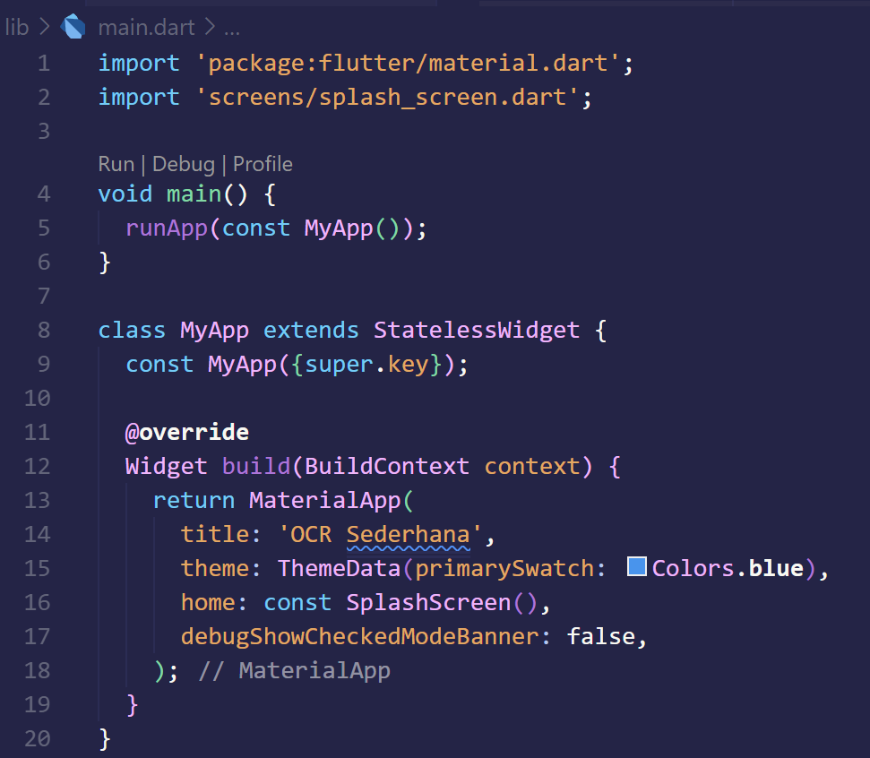
 

---

### **5.2. File: lib/screens/splash screen.dart**

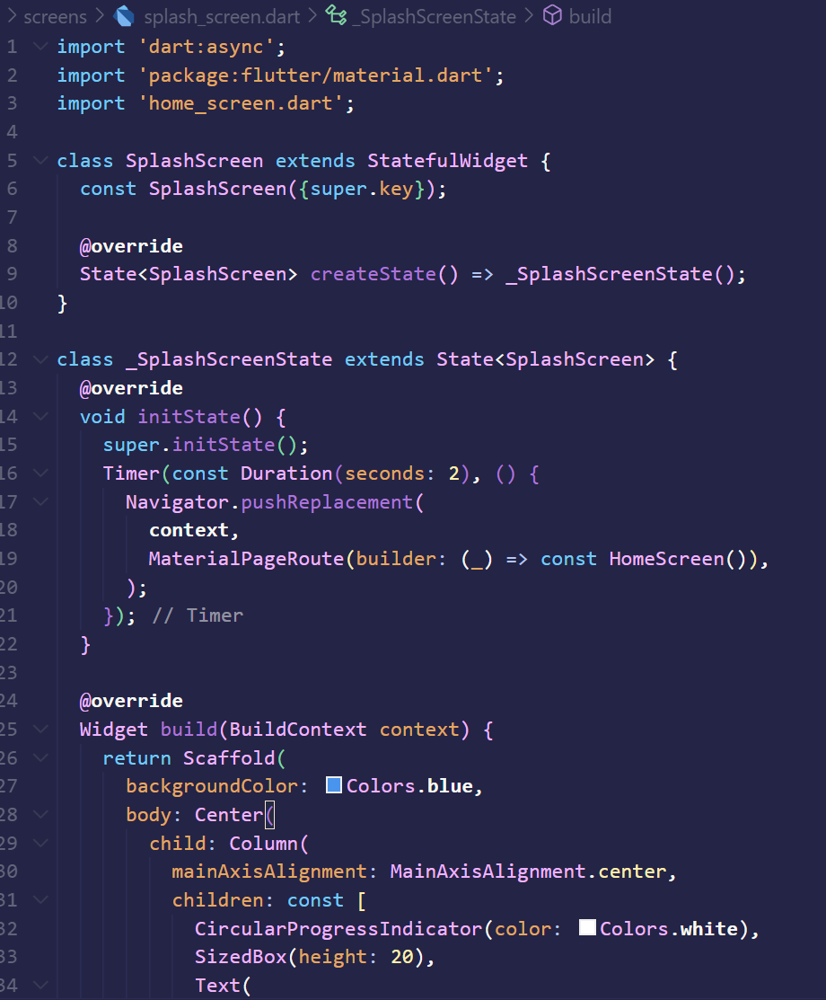
 

---

### **5.3. File: lib/screens/home screen.dart**

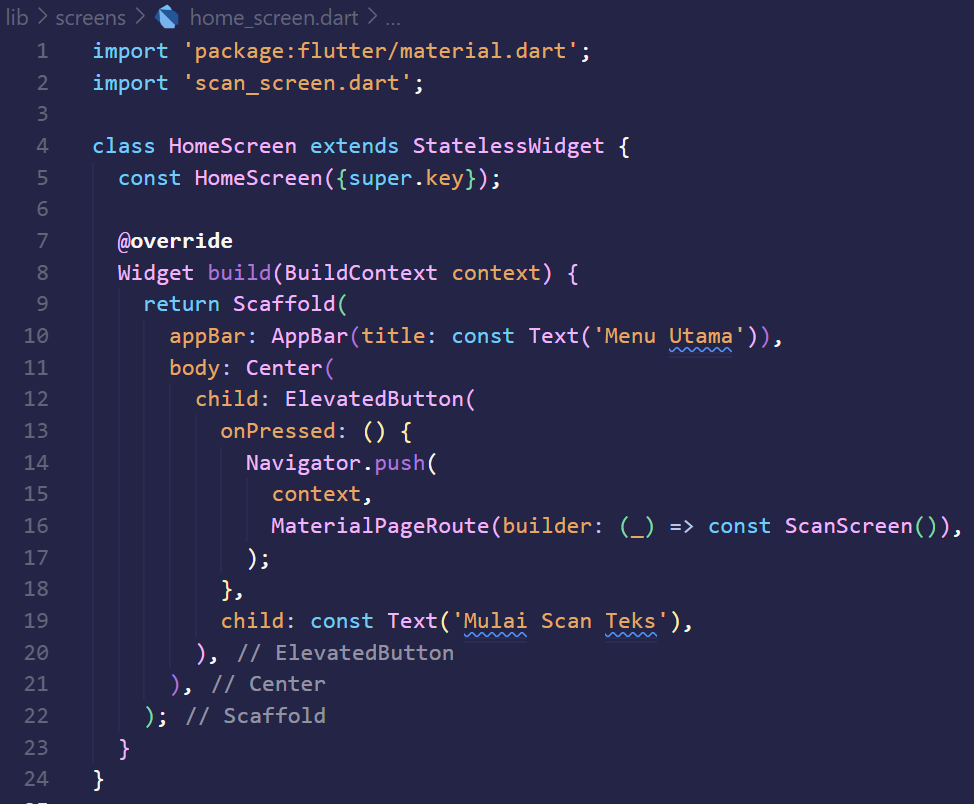
 

---

### **5.4. File: lib/screens/scan screen.dart**

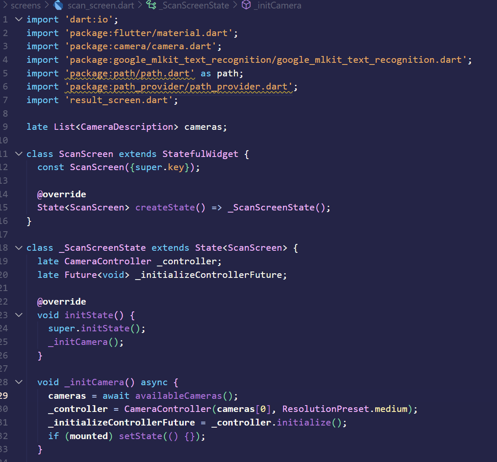
 

---

### **5.5. File: lib/screens/result screen.dart**

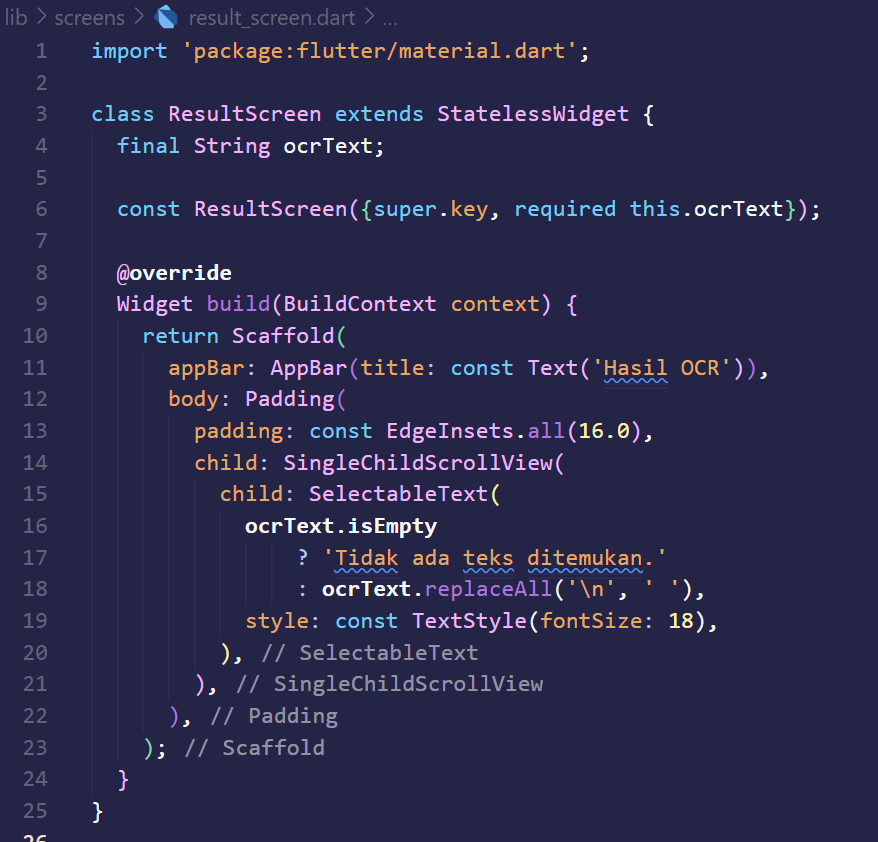
 

---

### **OUTPUT**

   
  <b>'klik mulai scan teks'</b>

   
  <b>'klik ambil foto dan scan'</b>

   
  <b>'hasil dari scan foto di atas adalah KA 3-5'</b>

---

## 6. Tugas Praktikum
### **1. Jalankan aplikasi di emulator atau HP.**

### **2. Lakukan scan terhadap teks cetak (misal: buku, koran, atau layar HP).**

### **3. Amati hasil OCR yang muncul.**

### **4. Jawab pertanyaan berikut:**
**a. Apakah semua teks terbaca dengan akurat? Mengapa?**  
**Jawaban:**
Tidak semua teks dapat terbaca dengan akurat. Akurasi hasil OCR bergantung pada kualitas gambar yang diambil, pencahayaan saat pemotretan, jenis dan ukuran font, serta kejernihan teks. Jika teks buram, miring, atau memiliki latar belakang yang gelap, sistem OCR sulit mengenali huruf dengan benar. Namun, jika teks jelas, kontras tinggi, dan pencahayaan baik, hasilnya bisa sangat akurat.

**b. Apa kegunaan fitur OCR dalam kehidupan sehari-hari?**  
**Jawaban:**
Fitur OCR berguna untuk mengubah teks dari gambar menjadi teks digital yang bisa disalin, disimpan, atau diedit. Dalam kehidupan sehari-hari, OCR membantu mempercepat proses penyalinan dokumen cetak, membaca teks dari papan informasi, nota, atau kartu identitas, serta memudahkan digitalisasi dokumen agar bisa dicari dan diarsipkan secara efisien.

**c. Sebutkan 2 contoh aplikasi nyata yang menggunakan OCR!**  
**Jawaban:**
1. Google Lens – untuk membaca dan menyalin teks dari gambar atau foto langsung melalui kamera. 
2. Microsoft Office Lens / Adobe Scan – untuk memindai dokumen atau kwitansi dan mengubahnya menjadi file teks atau PDF yang dapat diedit.

