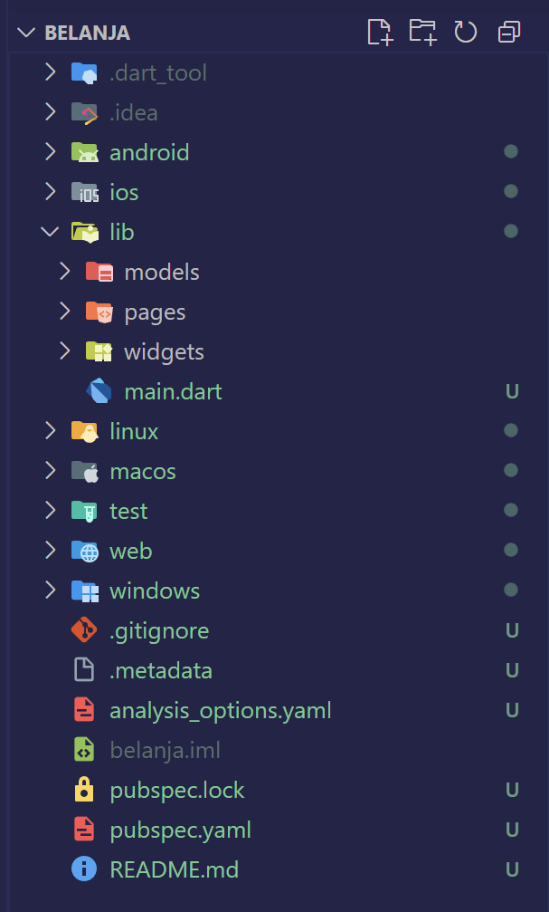
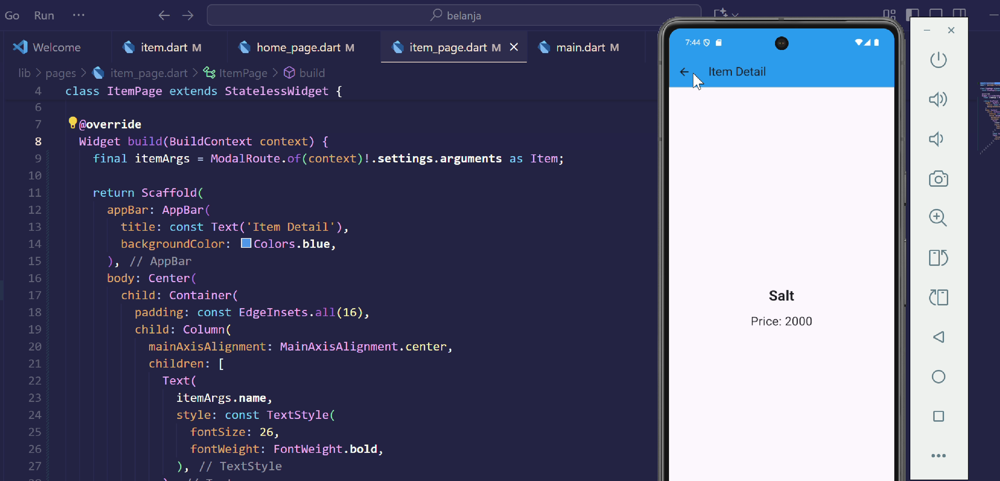
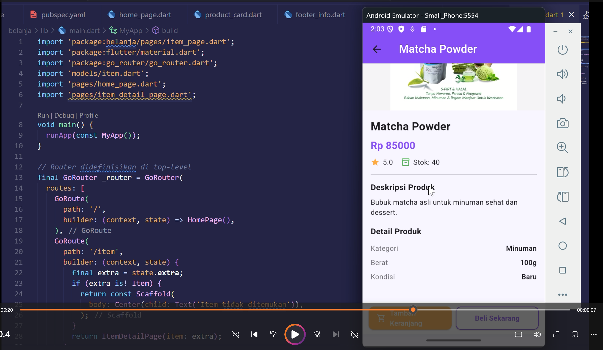

# 🛍️ Laporan Praktikum Flutter — Aplikasi Belanja

**Nama:** Khoir Karol Nurzuraidah  
**Kelas:** SIB 3C  
**Absen:** 20  

---

## PRAKTIKUM 5 Membangun Navigasi di Flutter — *APLIKASI BELANJA*

### **Langkah 1: Menyiapkan Project Baru**
Buat project Flutter baru dengan nama **belanja**.  
Susun folder project sesuai struktur yang ditentukan agar kode lebih terorganisasi.  

---

### **Langkah 2: Mendefinisikan Route**
Buat dua file Dart di dalam folder `pages`:

* `home_page.dart`
* `item_page.dart`

Deklarasikan:

* Class `HomePage` di `home_page.dart`
* Class `ItemPage` di `item_page.dart`  

Keduanya diturunkan dari `StatelessWidget`.  

---

### **Langkah 3: Melengkapi Kode di `main.dart`**
Tambahkan route unik:

* `/` → `HomePage`
* `/item` → `ItemPage`

Gunakan `initialRoute` untuk menentukan halaman awal.  

---

### **Langkah 4: Membuat Data Model**
Buat file **`item.dart`** di dalam folder **`models`**.  
Definisikan model berisi **nama** dan **harga**.  

---

### **Langkah 5: Melengkapi Kode di Class `HomePage`**
Gunakan `ListView` untuk menampilkan data yang diambil dari model berupa `List<Item>`.  

---

### **Langkah 6: Membuat ListView dengan `itemBuilder`**
Gunakan `itemBuilder` untuk menampilkan setiap data.  
Gunakan widget `Card` sebagai pembatas antar item.  

---

### **Langkah 7: Menambahkan Aksi pada ListView**
Tambahkan aksi klik menggunakan **InkWell**.  
Gunakan *Quick Fix* di VSCode → “Wrap with Widget” → ubah menjadi `InkWell` → tambahkan `onTap` untuk berpindah ke halaman `ItemPage`.  

---

## TUGAS PRAKTIKUM 2

### **1. Untuk melakukan pengiriman data ke halaman berikutnya, cukup menambahkan informasi arguments pada penggunaan Navigator. Perbarui kode pada bagian Navigator menjadi seperti berikut.**

### **2. Pembacaan nilai yang dikirimkan pada halaman sebelumnya dapat dilakukan menggunakan ModalRoute. Tambahkan kode berikut pada blok fungsi build dalam halaman ItemPage. Setelah nilai didapatkan, anda dapat menggunakannya seperti penggunaan variabel pada umumnya. (https://docs.flutter.dev/cookbook/navigation/navigate-with-arguments)**

### **3. Pada hasil akhir dari aplikasi belanja yang telah anda selesaikan, tambahkan atribut foto produk, stok, dan rating. Ubahlah tampilan menjadi GridView seperti di aplikasi marketplace pada umumnya. Ubah di main, home_page, item_page, item.dart dan pubspec nya**

### **4. Silakan implementasikan Hero widget pada aplikasi belanja Anda dengan mempelajari dari sumber ini: https://docs.flutter.dev/cookbook/navigation/hero-animations. Ubah di main, home_page, item_page.**

### **5. Sesuaikan dan modifikasi tampilan sehingga menjadi aplikasi yang menarik. Selain itu, pecah widget menjadi kode yang lebih kecil. Tambahkan Nama dan NIM di footer aplikasi belanja Anda.**

### **6. Selesaikan Praktikum 5: Navigasi dan Rute tersebut. Cobalah modifikasi menggunakan plugin go_router, lalu dokumentasikan dan push ke repository Anda berupa screenshot setiap hasil pekerjaan beserta penjelasannya di file README.md. Kumpulkan link commit repository GitHub Anda kepada dosen yang telah disepakati!**

✨ Selesai.
Laporan Praktikum Flutter (Aplikasi Belanja + Tugas) — Khoir Karol Nurzuraidah (SIB 3C / Absen 20)
