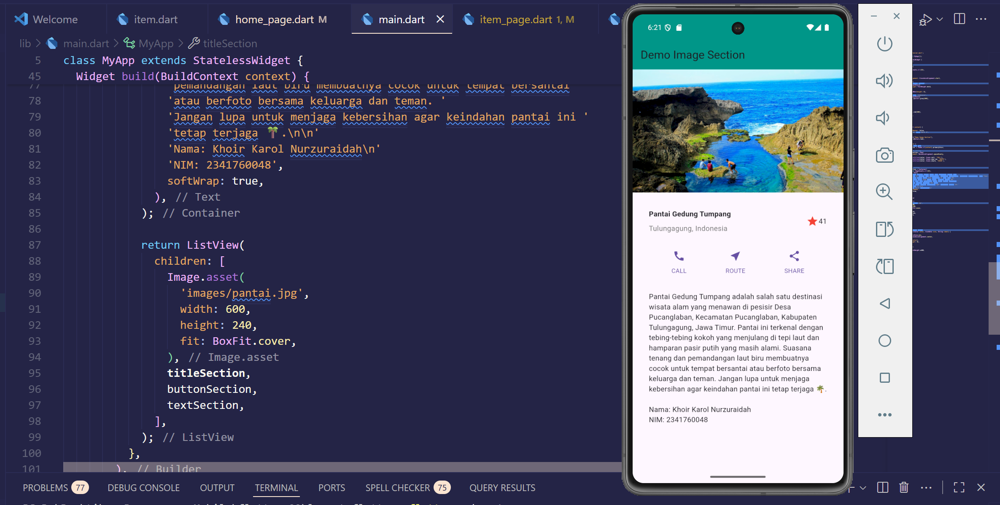

# Laporan Praktikum Flutter — Layout Flutter

**Nama:** Khoir Karol Nurzuraidah  
**Kelas:** SIB 3C  
**Absen:** 20  

---

##  PRAKTIKUM 1–4 — *LAYOUT_FLUTTER*

### **Praktikum 1: Membangun Layout di Flutter**

#### **Langkah 1: Buat Project Baru**
Buat sebuah project Flutter baru dengan nama **`layout_flutter`**, atau sesuaikan dengan gaya penulisan laporan praktikum yang Anda gunakan.  

---

#### **Langkah 2: Membuka file `lib/main.dart`**
Buka file `main.dart`, kemudian ganti isinya dengan kode berikut.  
Jangan lupa menuliskan **Nama dan NIM Anda** pada bagian text title.  

---

#### **Langkah 3: Identifikasi Layout Diagram**
Tahap ini dilakukan dengan memecah tata letak menjadi elemen-elemen dasarnya:

* Identifikasi baris dan kolom.  
* Tentukan apakah tata letak menggunakan grid.  
* Periksa apakah terdapat elemen yang saling tumpang tindih.  
* Pastikan apakah UI membutuhkan tab.  
* Perhatikan area yang memerlukan alignment, padding, maupun border.

Langkah awal adalah mengidentifikasi elemen utama.  
Pada contoh ini, terdapat **empat elemen** yang disusun ke dalam sebuah kolom, yaitu: **satu gambar, dua baris, dan satu blok teks.**

Setelah itu, buat diagram untuk setiap baris:

* **Baris pertama (Bagian Judul)** memiliki tiga anak: sebuah kolom teks, ikon bintang, dan angka.  
  Kolom teks berisi dua baris tulisan dan memakan ruang lebih besar, sehingga perlu dibungkus dengan widget `Expanded`.
* **Baris kedua (Bagian Tombol)** memiliki tiga anak, di mana masing-masing berupa kolom berisi ikon dan teks.

Setelah tata letak berhasil digambarkan dalam bentuk diagram, cara paling efektif untuk implementasi adalah menggunakan pendekatan **bottom-up**.  
Untuk mengurangi kompleksitas visual pada kode layout yang saling bertumpuk, beberapa bagian implementasi sebaiknya ditempatkan dalam variabel atau fungsi terpisah.

---

#### **Langkah 4: Implementasi Title Row**
##### **Soal 1**
Letakkan widget `Column` di dalam widget `Expanded` agar kolom dapat menyesuaikan ruang yang tersisa di dalam widget `Row`.  
Tambahkan properti `crossAxisAlignment` dengan nilai `CrossAxisAlignment.start` supaya posisi kolom berada di awal baris.  

##### **Soal 2**
Letakkan baris pertama teks di dalam `Container` agar bisa diberi `padding = 8`.  
Tambahkan teks **"Batu, Malang, Indonesia"** di dalam `Column`, lalu atur warnanya menjadi abu-abu.  

##### **Soal 3**
Dua item terakhir di baris judul adalah:  
* Sebuah ikon bintang berwarna merah.  
* Sebuah teks dengan nilai **"41"**.  

Seluruh baris diletakkan di dalam `Container` dengan `padding` sebesar **32 piksel** di setiap sisinya.  
Terakhir, ganti isi body text **"Hello World"** dengan variabel **`titleSection`**.  

---

### **Praktikum 2: Implementasi Button Row**

#### **Langkah 1: Membuat Method `_buildButtonColumn`**
Pada bagian tombol, terdapat tiga kolom dengan pola layout yang sama: ikon di atas teks.  
Masing-masing kolom berada dalam satu baris dengan jarak yang merata.  
Ikon dan teksnya menggunakan **warna utama (primary color)** agar konsisten dengan tema aplikasi.  

Supaya kode tidak berulang, kita buat sebuah **method helper** bernama `_buildButtonColumn()`.  
Method ini menerima parameter berupa **warna**, **ikon**, dan **teks**, lalu mengembalikan sebuah kolom widget dengan tampilan sesuai parameter yang diberikan.  

> 📂 File: `lib/main.dart → _buildButtonColumn`

---

#### **Langkah 2: Membuat Widget `buttonSection`**
Pada tahap ini, kita akan membuat sebuah widget baris yang berisi tiga kolom tombol (ikon + teks).  
Setiap kolom dibentuk dengan memanggil fungsi `_buildButtonColumn()` yang sudah dibuat sebelumnya, lalu diberi warna, ikon, dan label sesuai kebutuhan.Teks pada setiap kolom berada di dalam `Container` dengan margin bagian atas, supaya ada jarak antara ikon dan teks. Untuk meratakan posisi kolom, gunakan gunakan Row dengan properti mainAxisAlignment: MainAxisAlignment.spaceEvenly. Dengan begitu, setiap kolom akan mendapat jarak yang sama baik sebelum, di antara, maupun sesudahnya.

#### **Langkah 3: Tambah buttonSection ke Body**
Tambahkan variabel buttonSection ke dalam body seperti berikut.

### **Praktikum 3: Implementasi Text Section**
#### **Langkah 1: Buat Widget textSection**
Tentukan bagian teks sebagai variabel.
Masukkan teks ke dalam Container dan tambahkan padding di sepanjang setiap tepinya.
Tambahkan kode berikut tepat di bawah deklarasi buttonSection.
Dengan memberi nilai softWrap = true, baris teks akan memenuhi lebar kolom sebelum membungkusnya pada batas kata.

#### **Langkah 2: Tambahkan Variabel textSection ke Body**
Tambahkan widget variabel textSection ke dalam body.

### **Praktikum 4: Implementasi Image Section
#### **Langkah 1: Menyiapkan Aset Gambar**
Cari gambar dari internet yang ingin ditampilkan.
Selanjutnya, buat folder images di direktori utama project layout_flutter.
Simpan file gambar ke dalam folder tersebut, lalu daftarkan nama file gambar di file pubspec.yaml.

#### **Langkah 2: Tambahkan Gambar ke Body**
Tambahkan aset gambar ke dalam body.
Gunakan BoxFit.cover agar gambar menutupi seluruh area render dengan proporsi yang baik.

#### **Langkah 3: Mengubah Menjadi ListView**
Ubah susunan elemen dari Column menjadi ListView.
ListView mendukung fitur scrolling otomatis, sehingga tampilan tetap rapi dan responsif di layar kecil.

✨ Selesai.
Laporan Praktikum Flutter (Layout) — Khoir Karol Nurzuraidah (SIB 3C / Absen 20)
