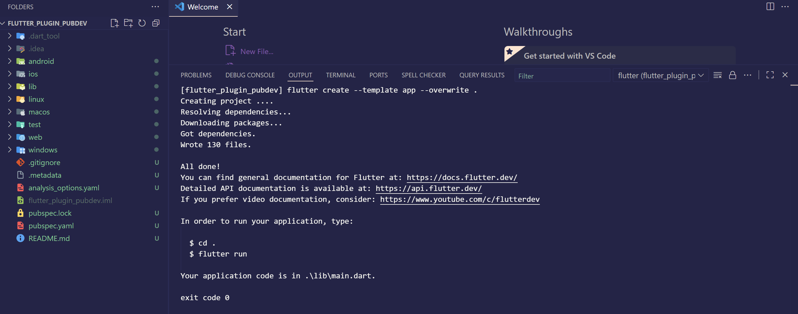
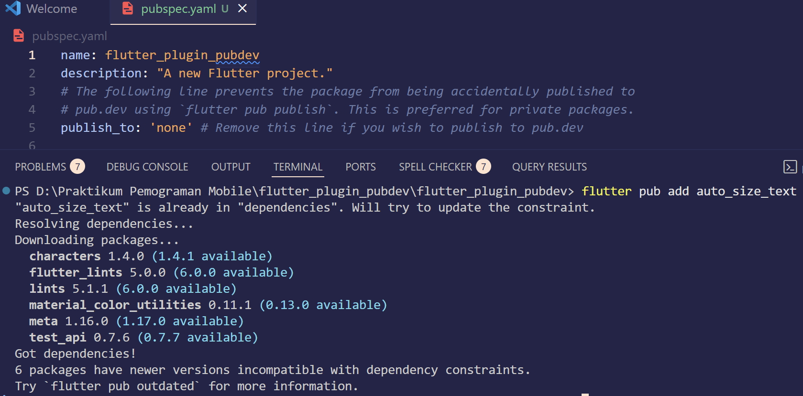
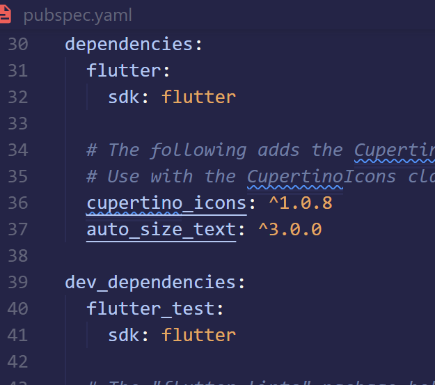
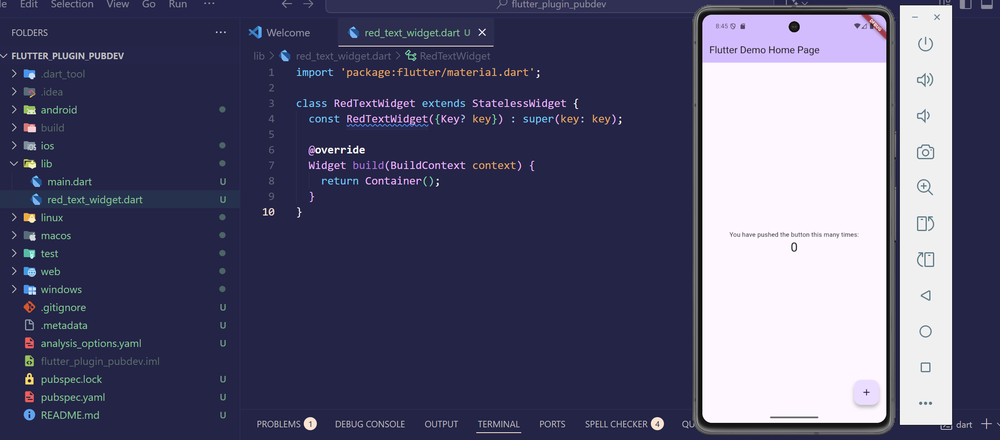
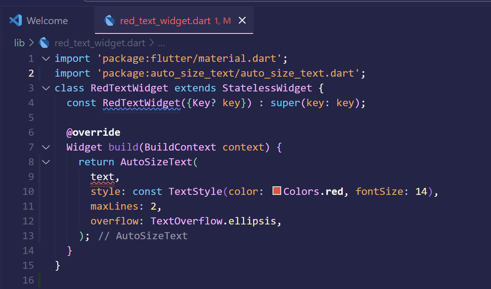
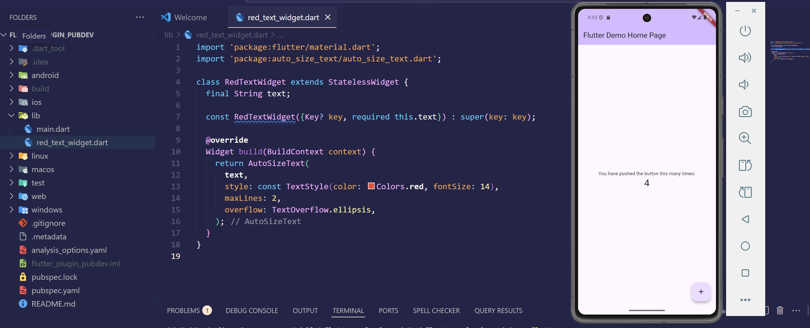
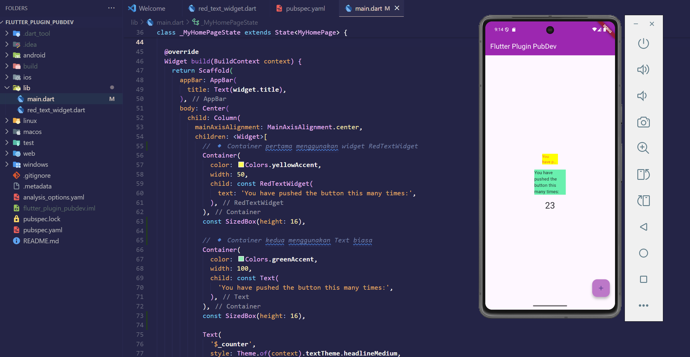

<table>
  <tr>
    <td width="180" align="center">
      
    </td>
    <td>
      <h2>Jurusan Teknologi Informasi Politeknik Negeri Malang</h2>
      <h3>Jobsheet 7: Manajemen Plugin</h3>
      <h3>Mata Kuliah Pemrograman Mobile</h3>
      <em>Oktober 2025</em>
    </td>
  </tr>
</table>

---

**Nama:** Khoir Karol Nurzuraidah  
**Kelas:** SIB 3C  
**No. Absen:** 20  

---

# 🚀 Praktikum Flutter Plugin PubDev

## Deskripsi
Project ini merupakan hasil praktikum mata kuliah *Pemrograman Mobile* dengan topik **Manajemen Plugin**.  
Tujuan dari praktikum ini adalah memahami cara menambahkan plugin eksternal dari **Pub.dev**, membuat widget custom, dan menampilkan teks yang responsif menggunakan **AutoSizeText**.

---

## Langkah-Langkah Praktikum

### **Langkah 1: Membuat Project Baru**
Buatlah sebuah project flutter baru dengan nama flutter_plugin_pubdev. Lalu jadikan repository di GitHub Anda dengan nama flutter_plugin_pubdev.

  

---

### **Langkah 2: Menambahkan Plugin**
Tambahkan plugin auto_size_text menggunakan perintah berikut di terminal. Jika berhasil, maka akan tampil nama plugin beserta versinya di file pubspec.yaml pada bagian dependencies

    

---

### **Langkah 3: Buat file red_text_widget.dart**
Buat file baru bernama red_text_widget.dart di dalam folder lib lalu isi kode seperti berikut.

   

---

### **Langkah 4: Tambah Widget AutoSizeText**
Masih di file red_text_widget.dart, untuk menggunakan plugin auto_size_text, ubahlah kode return Container() menjadi seperti berikut. Setelah Anda menambahkan kode di atas, Anda akan mendapatkan info error. Mengapa demikian? Jelaskan dalam laporan praktikum Anda!

 
**Jawaban:**
Penjelasan kenapa muncul error:
Error muncul karena variabel text belum didefinisikan.
Widget AutoSizeText membutuhkan argumen text (tipe String) untuk ditampilkan, tetapi kita belum membuat variabel tersebut di dalam class RedTextWidget.

---

### **Langkah 5: Buat Variabel text dan parameter di constructor**
Tambahkan variabel text dan parameter di constructor seperti berikut.

 

---

### **Langkah 6: Tambahkan widget di main.dart**
Buka file main.dart lalu tambahkan di dalam children: pada class _MyHomePageState

 
Run aplikasi tersebut dengan tekan F5, maka hasilnya akan seperti berikut

---

## Tugas Praktikum
### **1. Selesaikan Praktikum tersebut, lalu dokumentasikan dan push ke repository Anda berupa screenshot hasil pekerjaan beserta penjelasannya di file README.md!**

### **2. Jelaskan maksud dari langkah 2 pada praktikum tersebut!**
**Jawaban:**
Maksudnya adalah agar project kita bisa menggunakan fitur tambahan dari plugin tersebut. Plugin ini tidak termasuk dalam bawaan Flutter, jadi perlu didaftarkan di file pubspec.yaml agar dapat diunduh dan digunakan.
Setelah ditambahkan, Flutter akan mengenali class dan fungsi-fungsi yang ada di plugin auto_size_text, seperti AutoSizeText(), yang berfungsi untuk menampilkan teks dengan ukuran yang otomatis menyesuaikan ruang yang tersedia. 
Kesimpulan:
Langkah ini bertujuan untuk menambahkan dependensi eksternal (plugin) ke dalam project Flutter supaya bisa memakai fitur baru yang belum ada di Flutter standar.

### **3. Jelaskan maksud dari langkah 5 pada praktikum tersebut!**
**Jawaban:**
Maksud dari langkah ini adalah untuk membuat RedTextWidget memiliki parameter input berupa teks yang ingin ditampilkan.
Dengan adanya parameter text, maka ketika widget ini digunakan di file main.dart, kita bisa memanggilnya seperti:
RedTextWidget(text: 'You have pushed the button this many times:') 
Kesimpulan:
Langkah ini bertujuan agar widget RedTextWidget dapat menerima data dari luar (parameter text) dan menampilkannya secara dinamis.

### **4. Pada langkah 6 terdapat dua widget yang ditambahkan, jelaskan fungsi dan perbedaannya!**
**Jawaban:**
ada langkah 6 terdapat dua widget utama yang ditambahkan di dalam Column, yaitu: 
a. RedTextWidget
Container(
  color: Colors.yellowAccent,
  width: 50,
  child: const RedTextWidget(
    text: 'You have pushed the button this many times:',
  ),
), 
Fungsi:
•	Menampilkan teks berwarna merah.
•	Menggunakan plugin AutoSizeText sehingga ukuran teks otomatis menyesuaikan lebar container.
•	Dibatasi hanya sampai 2 baris dan jika lebih, akan menampilkan tanda ellipsis (...). 
b. Text
Container(
  color: Colors.greenAccent,
  width: 100,
  child: const Text(
    'You have pushed the button this many times:',
  ),
), 
Fungsi:
•	Menampilkan teks biasa dengan warna default (hitam).
•	Tidak memiliki fitur otomatis menyesuaikan ukuran teks.
•	Jika teks terlalu panjang, teks bisa terpotong atau meluap dari batas container. 
Perbedaan utama:
Perbandingan RedTextWidget dan Text
1. Plugin yang digunakan
Pada widget RedTextWidget, digunakan plugin AutoSizeText yang diimpor dari Pub.dev untuk menampilkan teks secara dinamis dan responsif.
Sementara pada widget Text, tidak menggunakan plugin tambahan karena merupakan widget bawaan dari Flutter.

2. Penyesuaian ukuran teks otomatis
Widget RedTextWidget dapat menyesuaikan ukuran teks secara otomatis terhadap lebar container sehingga teks tidak akan meluap keluar area tampilan.
Sedangkan widget Text memiliki ukuran teks yang tetap, sehingga ketika teks terlalu panjang, sebagian teks bisa terpotong atau keluar dari batas container.

3. Warna teks
Widget RedTextWidget menampilkan teks berwarna merah, sesuai dengan gaya teks (TextStyle) yang ditentukan dalam widget.
Sedangkan widget Text menampilkan teks dengan warna hitam secara default, kecuali jika diubah secara manual melalui properti style.

4. Batas baris dan ellipsis
Pada widget RedTextWidget, teks dibatasi maksimal 2 baris, dan jika panjang teks melebihi batas, maka akan otomatis menampilkan tanda ellipsis (...) di akhir teks.
Sebaliknya, pada widget Text, teks tidak memiliki batas baris secara default, sehingga teks akan terus ditampilkan selama masih ada ruang.

5. Responsif terhadap lebar container
Widget RedTextWidget lebih responsif terhadap perubahan ukuran container karena AutoSizeText secara otomatis menyesuaikan ukuran font agar teks tetap terlihat penuh tanpa overflow.
Sementara itu, widget Text tidak sepenuhnya responsif — ukuran teks tidak berubah meskipun ukuran container berubah.

### **5. Jelaskan maksud dari tiap parameter yang ada di dalam plugin auto_size_text berdasarkan tautan pada dokumentasi ini ! https://pub.dev/documentation/auto_size_text/latest/**
**Jawaban:**
Berdasarkan dokumentasi AutoSizeText di pub.dev, berikut penjelasan parameter penting yang digunakan dalam praktikum:
AutoSizeText(
  text,
  style: const TextStyle(color: Colors.red, fontSize: 14),
  maxLines: 2,
  overflow: TextOverflow.ellipsis,
);

Penjelasan Parameter pada Plugin AutoSizeText:
1. text (String)
Parameter ini berfungsi untuk menentukan isi teks yang akan ditampilkan pada widget.
Nilai yang diberikan harus berupa string, misalnya 'Halo Dunia!' atau 'You have pushed the button this many times:'.

2. style (TextStyle)
Parameter ini digunakan untuk mengatur tampilan teks, seperti warna, ukuran huruf, ketebalan font, dan jenis huruf yang digunakan.
Contohnya:
style: TextStyle(color: Colors.red, fontSize: 14)
akan menampilkan teks berwarna merah dengan ukuran font 14.

3. maxLines (int)
Parameter ini menentukan jumlah maksimum baris teks yang boleh ditampilkan.
Jika teks melebihi jumlah baris yang ditentukan, maka baris berikutnya tidak akan ditampilkan.
Misalnya, maxLines: 2 berarti teks hanya akan tampil maksimal dua baris.

4. overflow (TextOverflow)
Parameter ini menentukan apa yang terjadi jika teks melebihi batas baris atau ruang yang tersedia.
Jika menggunakan TextOverflow.ellipsis, maka teks yang terlalu panjang akan diganti dengan tanda titik tiga (...) di akhir teks.
Contohnya:
overflow: TextOverflow.ellipsis
menandakan bahwa teks berlebih akan disingkat dengan ellipsis.

Kesimpulan:
Plugin auto_size_text membantu menampilkan teks yang responsif dan mudah dibaca di berbagai ukuran layar dengan fitur penyesuaian otomatis.

### **6. Kumpulkan laporan praktikum Anda berupa link repository GitHub kepada dosen!**
