<table>
  <tr>
    <td width="180" align="center">
      
    </td>
    <td>
      <h2>Jurusan Teknologi Informasi Politeknik Negeri Malang</h2>
      <h3>Jobsheet: Aplikasi OCR Sederhana Dengan Flutter</h3>
      <h3>Mata Kuliah Pemrograman Mobile</h3>
      <em>Oktober 2025</em>
    </td>
  </tr>
</table>

---

**Nama:** Khoir Karol Nurzuraidah  
**Kelas / NIM:** SIB 3C / 2341760048  
**No. Absen:** 20   
**Tanggal:** 16 OKtober 2025  
**Guru / Dosen:** Ade Ismail, S.Kom., M.TI.  

# 🚀 Praktikum Aplikasi OCR Sederhana Dengan Flutter

## 2. TUJUAN PRAKTIKUM
Setelah menyelesaikan jobsheet ini, siswa/mahasiswa mampu:
1. Membuat aplikasi Flutter multi-halaman.
2. Menggunakan plugin kamera untuk mengambil gambar.
3. Mengintegrasikan OCR (Optical Character Recognition) menggunakan library
google mlkit text recognition.
4. Menampilkan hasil OCR di halaman terpisah.
5. Menerapkan navigasi dasar antar layar menggunakan Navigator.

---

## 3. ALAT DAN BAHAN
• Laptop/komputer dengan Flutter SDK terinstal  
• VS Code atau Android Studio  
• Emulator Android atau perangkat Android fisik  
• Koneksi internet (untuk instalasi dependensi)

---

## 4. Langkah Kerja

### **4.1. Langkah 1: Buat Proyek Baru**
Buka terminal, lalu jalankan:

  

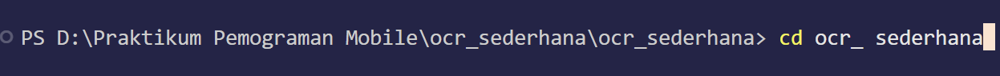
 

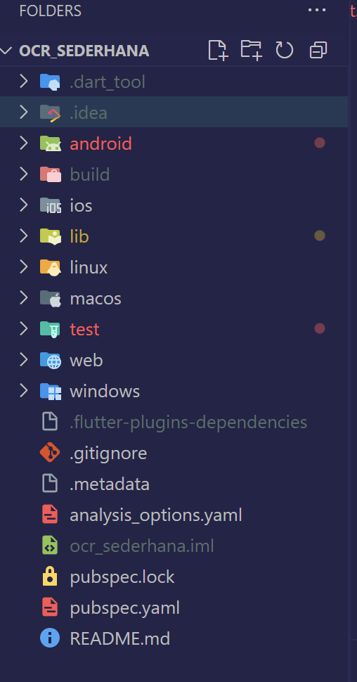
  

---

### **4.2. Langkah 2: Tambahkan Plugin**
Buka file pubspec.yaml, lalu tambahkan dependensi berikut di bawah bagian dependencies:

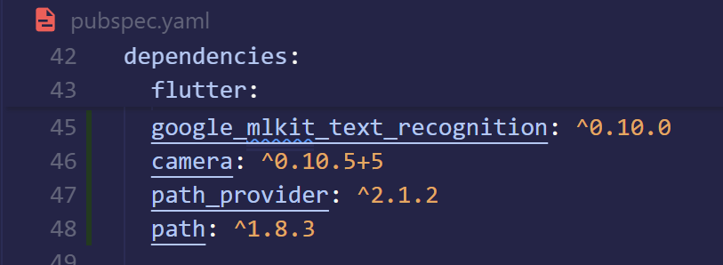

Simpan file, lalu jalankan:

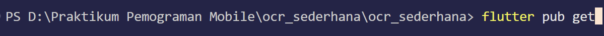
  

---

### **4.3. Langkah 3: Tambahkan Izin Kamera (Android)**
Buka file: android/app/src/main/AndroidManifest.xml
Tambahkan baris berikut di dalam tag <manifest>, sebelum <application>:

   

---

### **4.4. Langkah 4: Buat Struktur Folder**
Di dalam folder lib/, buat struktur berikut:

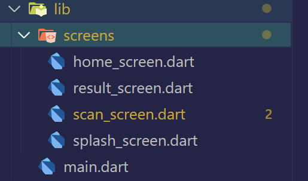
 

---
## 5. Kode Program

### **5.1. File: lib/main.dartr**

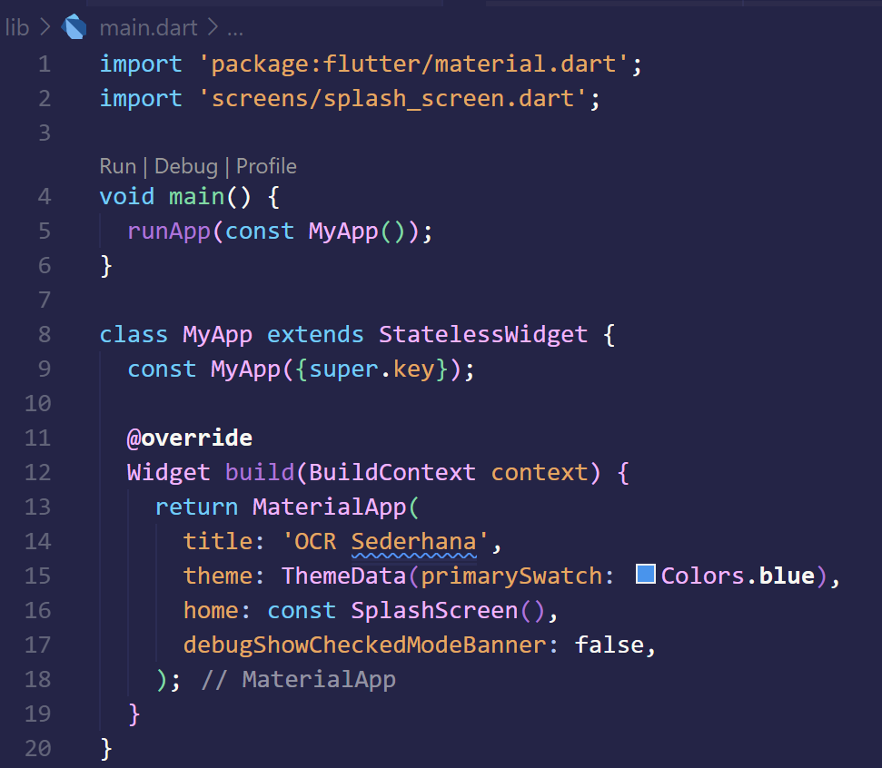
 

---

### **5.2. File: lib/screens/splash screen.dart**

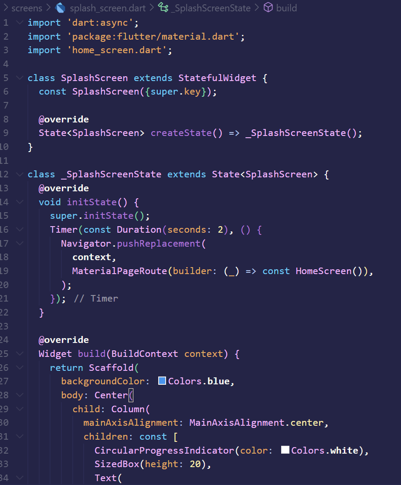
 

---

### **5.3. File: lib/screens/home screen.dart**

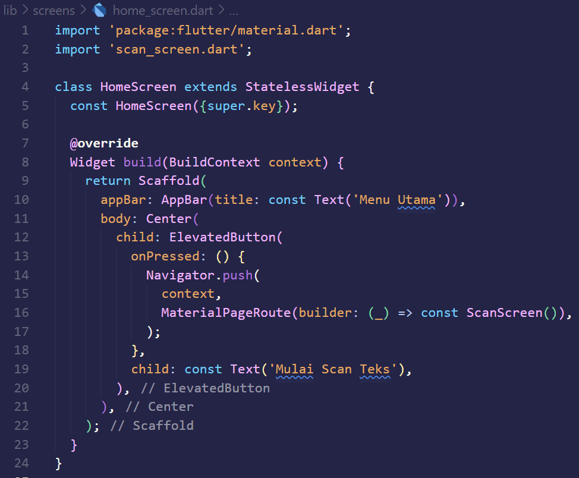
 

---

### **5.4. File: lib/screens/scan screen.dart**

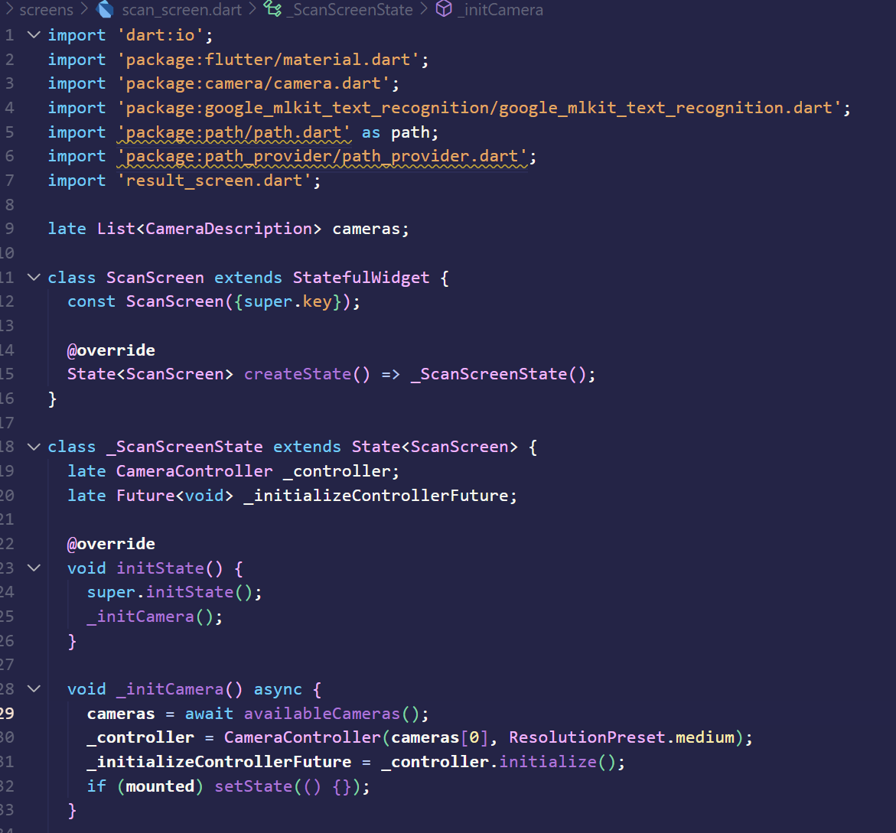
 

---

### **5.5. File: lib/screens/result screen.dart**

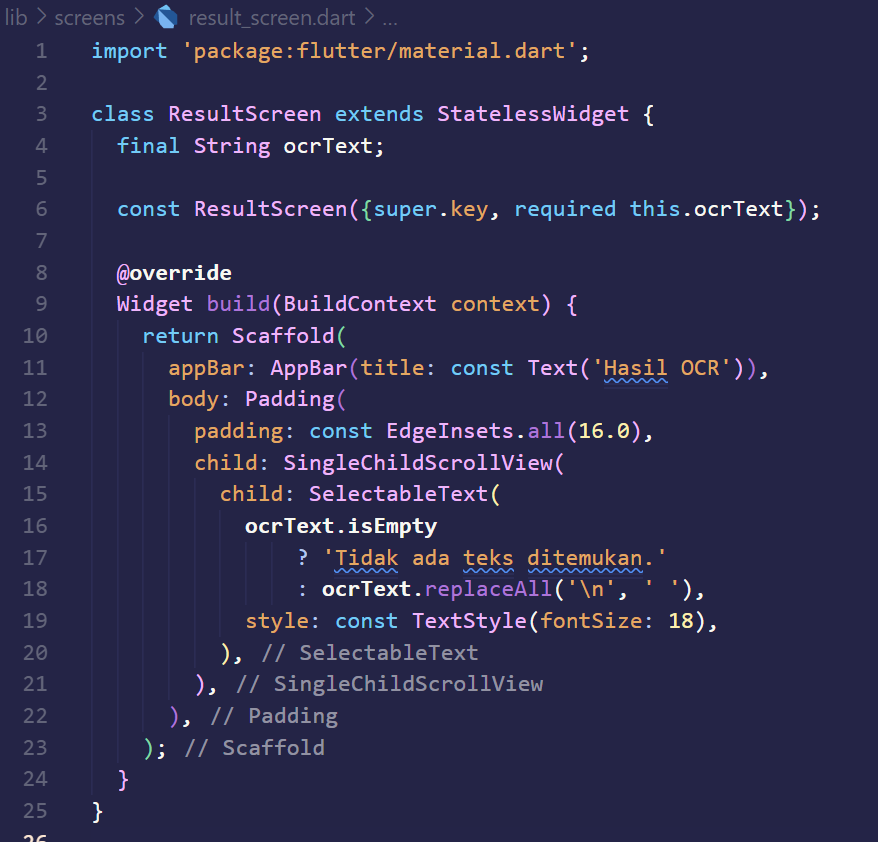
 

---

### **OUTPUT**

  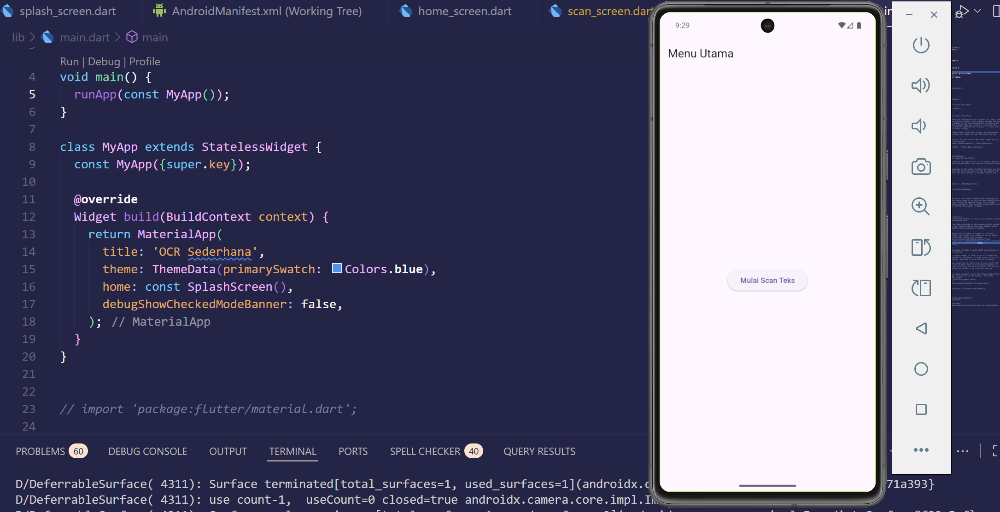 
  <b>'klik mulai scan teks'</b>

  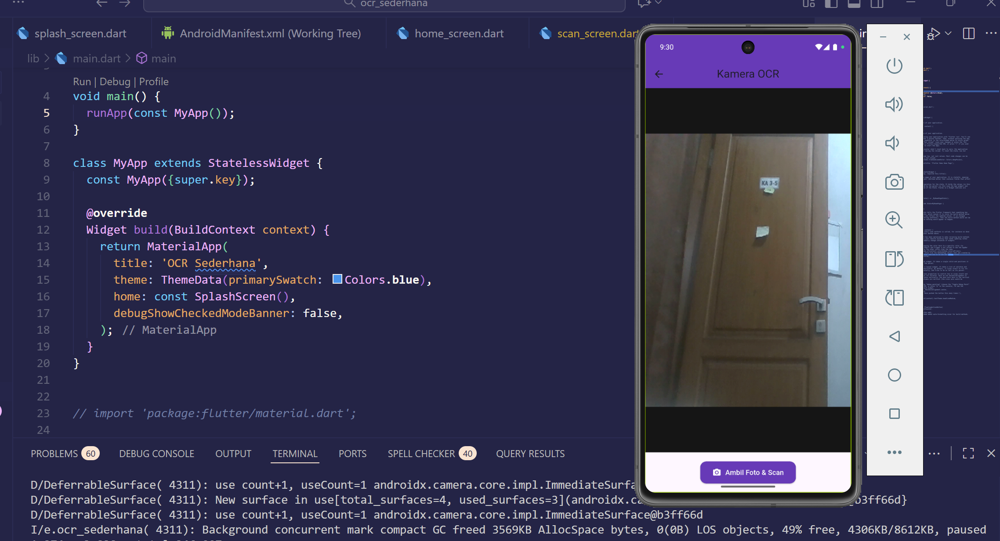 
  <b>'klik ambil foto dan scan'</b>

  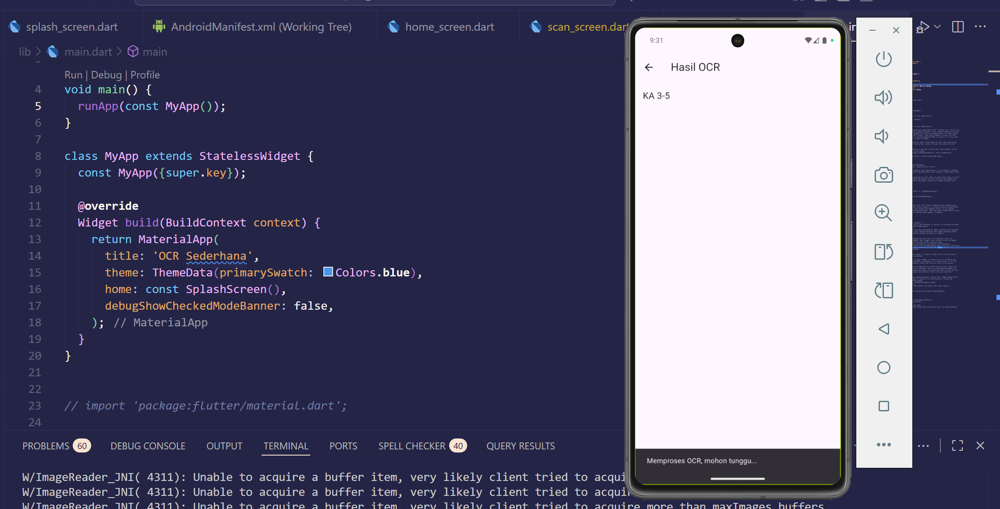 
  <b>'hasil dari scan foto di atas adalah KA 3-5'</b>

---

## 6. Tugas Praktikum
### **1. Jalankan aplikasi di emulator atau HP.**

### **2. Lakukan scan terhadap teks cetak (misal: buku, koran, atau layar HP).**

### **3. Amati hasil OCR yang muncul.**

### **4. Jawab pertanyaan berikut:**
**a. Apakah semua teks terbaca dengan akurat? Mengapa?**  
**Jawaban:**
Tidak semua teks dapat terbaca dengan akurat. Akurasi hasil OCR bergantung pada kualitas gambar yang diambil, pencahayaan saat pemotretan, jenis dan ukuran font, serta kejernihan teks. Jika teks buram, miring, atau memiliki latar belakang yang gelap, sistem OCR sulit mengenali huruf dengan benar. Namun, jika teks jelas, kontras tinggi, dan pencahayaan baik, hasilnya bisa sangat akurat.

**b. Apa kegunaan fitur OCR dalam kehidupan sehari-hari?**  
**Jawaban:**
Fitur OCR berguna untuk mengubah teks dari gambar menjadi teks digital yang bisa disalin, disimpan, atau diedit. Dalam kehidupan sehari-hari, OCR membantu mempercepat proses penyalinan dokumen cetak, membaca teks dari papan informasi, nota, atau kartu identitas, serta memudahkan digitalisasi dokumen agar bisa dicari dan diarsipkan secara efisien.

**c. Sebutkan 2 contoh aplikasi nyata yang menggunakan OCR!**  
**Jawaban:**
1. Google Lens – untuk membaca dan menyalin teks dari gambar atau foto langsung melalui kamera. 
2. Microsoft Office Lens / Adobe Scan – untuk memindai dokumen atau kwitansi dan mengubahnya menjadi file teks atau PDF yang dapat diedit.

